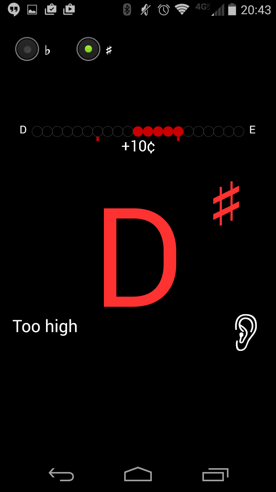
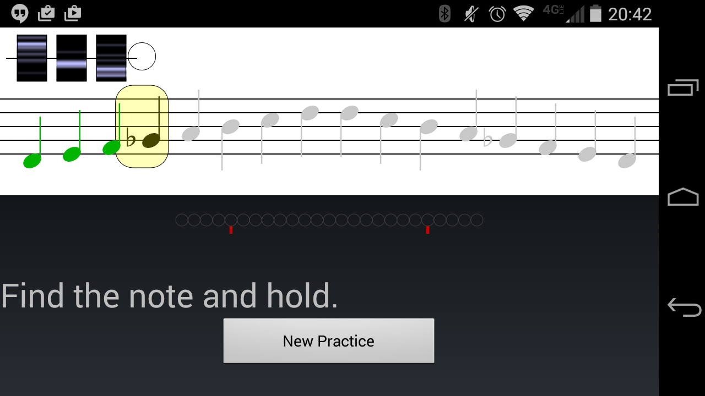

![icon] Precise Pitch
---------------------

My first Android development experiment, so don't expect anything nice here.
It needs some work to be fully a proper Android app.

Essentially, this is a little instrument tuner and little game to practice your
scales, including feedback.

## Getting started ##
With `ANDROID_HOME` set to the location of the sdk and
`JAVA_HOME` set to the jdk, connect your debug enabled phone and type:

    ant debug && ant installd

These are the two interesting activities

A Tuner

.. and a scale practice activity showing a histogram of how far off you are
for certain notes and gives you a final score.

[icon]: ./res/drawable-mdpi/ic_launcher_pp.png
